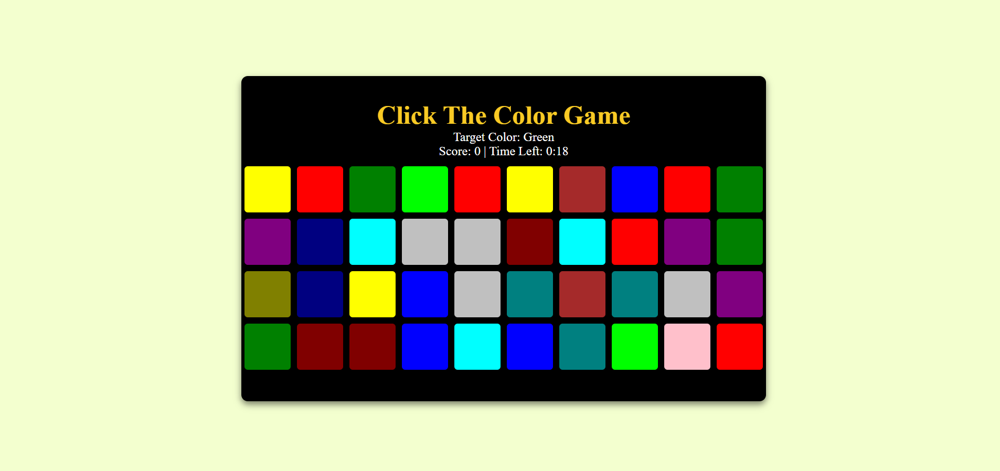
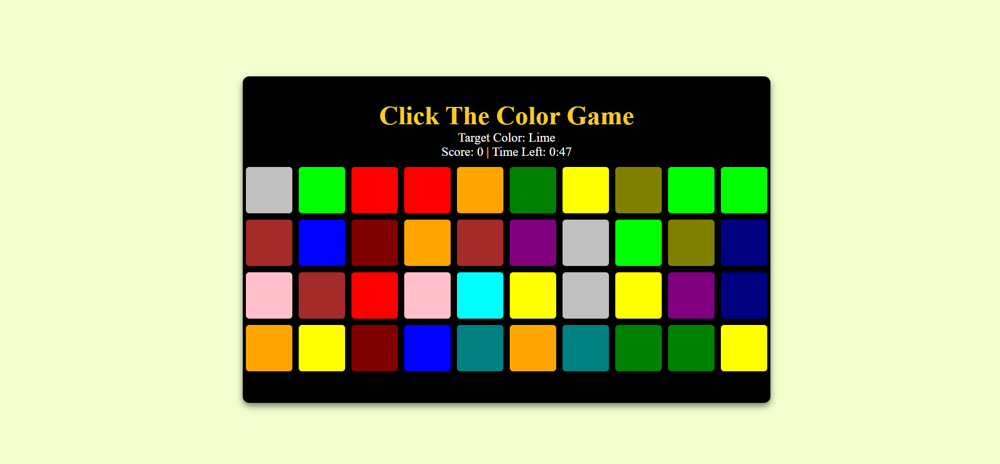

# Pick_The_Color_Game
📌 Choose the Color - A Fun Color Guessing Game! 🎨

🚀 About the Project
Welcome to "Choose the Color", a fun and interactive color-guessing game designed to enhance your ability to recognize RGB colors! 🌈 Built using HTML, CSS, Bootstrap, and JavaScript, this game demonstrates Document Object Manipulation (DOM) in action.

🎯 Objective:

Players must guess the correct color based on the given RGB value.
Select the right color from multiple choices and test your knowledge!
💡 Key Features:
✔️ Dynamic color selection using JavaScript
✔️ Interactive and responsive UI with Bootstrap
✔️ Score tracking and feedback system
✔️ DOM manipulation for real-time updates

🖥️ Live Demo
🔗 Play the Game Here! https://pick-the-color-game.vercel.app/

🛠️ Built With
🔹 HTML5 – Structuring the game layout
🔹 CSS3 – Styling and animations
🔹 JavaScript – Game logic and interactivity

Game Start	Playing the Game	Winning Screen	
📂 Installation & Setup
1️⃣ Clone this repository:

bash
Copy
Edit
git clone https://github.com/your-username/choose-the-color-game.git
2️⃣ Navigate to the project folder:

bash
Copy
Edit
cd choose-the-color-game
3️⃣ Open index.html in your browser! 🚀

(No additional setup required!)

🤝 Contributing
Want to improve this game? Feel free to contribute!

Fork this repository
Clone your forked repo
Create a new branch
Make your changes
Submit a Pull Request
📜 License
📝 This project is licensed under the MIT License – Feel free to modify and share!

📬 Contact
📧 Your Name: Priyanshu Acharya
🔗 GitHub:[ @your-github](https://github.com/PriyanshuAcharya41/)

